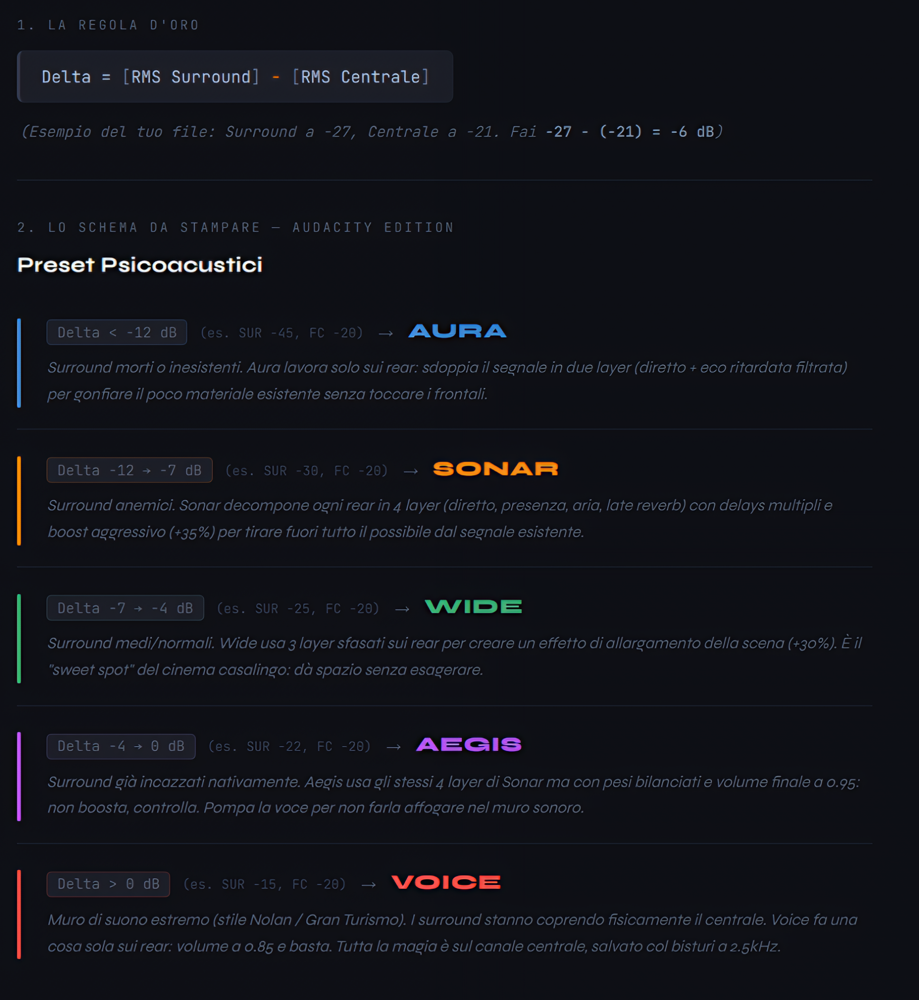

<p align="left">
  
</p>

# 🎧 Sonary Suite — Sonar / Wide / Aegis / Aura / Voice
### Psychoacoustic Surround Toolkit (FFmpeg-based)

Suite di script **FFmpeg-based** per l’elaborazione **offline** di tracce audio **5.1**, progettata per migliorare **intelligibilità del parlato**, **coerenza timbrica** e **spazialità surround** senza stravolgere il mix originale.

Pensata per AVR usati in modalità **Straight / Pure / Direct** (testata e ottimizzata su **Yamaha RX-V4A con crossover 160Hz**) e compatibile con sistemi di correzione ambientale come **YPAO**.

> “Non tutti i supereroi indossano un mantello… a volte basta un `-filter_complex` per salvare il mondo del 5.1.”  
> ⚡ Sandro (D@mocle77) Sabbioni | perception follows physics ⚡

---

## 🧠 Filosofia del progetto

Sonary Suite nasce da un principio semplice ma rigoroso:

> *correggere solo ciò che serve, dove serve, e nel modo meno invasivo possibile.*

Per questo motivo:
- l’elaborazione è **offline** (nessun DSP in tempo reale sull’AVR)
- **FL / FR restano neutri**
- il canale **Centrale (FC)** riceve una EQ dedicata e costante
- i **Surround** sono l’unico elemento variabile (Sonar / Wide / Aegis / Aura oppure bypass in Voice)
- il sistema **non applica preset “a sensazione”**: misura e poi decide

Risultato: un suono più leggibile, stabile e naturale, che **non combatte** né YPAO né il mix originale.

---

## ✅ Requisiti

### Software
- **FFmpeg 7+** (consigliato con resampler **SOXR**)
- **Bash 4.x+**

### Sistemi operativi
- Linux
- macOS
- Windows (**WSL2**, **Git-Bash**, **MSYS2**)

> Nota “fisica non negoziabile”: **AC3 / E-AC3 si codificano sempre via CPU**. L’eventuale HW accel riguarda al massimo la *decodifica video*, non l’encoding audio.

---

## 🚀 Installazione

```bash
git clone https://github.com/Damocle77/Sonary_Suite.git
cd Sonary_Suite
chmod +x aegis_sonar_wide_aura_voice.sh
chmod +x stereo251_upmix.sh
chmod +x asmr_vr_intimate.sh
chmod +x surround_preset_advisor.sh
```

---

## 🎧 Preset disponibili

| Preset | Filosofia | Energia effettiva (indicativa) |
|-------|-----------|-------------------------------|
| **VOICE** | Solo EQ Voce Sartoriale sul canale centrale | ~1.08× |
| **AURA** | Wide Light – spazio laterale soft | ~1.37× |
| **WIDE** | Ampiezza orizzontale (illusione 7.1) | ~1.97× |
| **AEGIS** | Cupola bilanciata con controllo dinamico | ~2.18× |
| **SONAR** | Altezza psicoacustica (illusione 5.1.2) | ~3.69× |

---

## 📦 Suite completa – 4 script

### 1️⃣ `aegis_sonar_wide_aura_voice.sh` — Processing 5.1 esistente
Elabora tracce **5.1 già presenti** con DSP surround psicoacustico.

**Utilizzo**
```bash
./aegis_sonar_wide_aura_voice.sh <ac3|eac3> <si|no> [file|""] [bitrate] [sonar|wide|aegis|aura|voice]
```

**Parametri**
- **codec**: `ac3` | `eac3`
- **keep_orig**: `si` | `no` (mantiene o no anche la traccia originale)
- **file**: `"film.mkv"` | `""` (batch: elabora tutti i file nella cartella)
- **bitrate**: es. `448k`, `640k`, `768k` (default tipici: `ac3=640k`, `eac3=768k`)
- **mode**:
  - `sonar` = altezza (simulazione psicoacustica 5.1.2 verticale)
  - `wide`  = ampiezza (simulazione psicoacustica 7.1 orizzontale)
  - `aegis` = intermedia (guardia dinamica + cupola controllata)
  - `aura`  = **Wide Light** (spazio laterale “soft”)
  - `voice` = **solo EQ Voce Sartoriale su FC** (surround pass-through)

**Esempi**
```bash
# Sci-fi / fantasy → SONAR (altezza)
./aegis_sonar_wide_aura_voice.sh eac3 no "interstellar.mkv" 768k sonar

# Action moderno → WIDE (ampiezza laterale)
./aegis_sonar_wide_aura_voice.sh eac3 no "fast_furious.mkv" 768k wide

# Thriller / dinamica variabile → AEGIS (controllo)
./aegis_sonar_wide_aura_voice.sh eac3 no "batman.mkv" 640k aegis

# Drama / dialoghi → AURA (spazio discreto)
./aegis_sonar_wide_aura_voice.sh ac3 si "drama.mkv" 640k aura

# Mix piatti / surround inutili → VOICE (solo voce)
./aegis_sonar_wide_aura_voice.sh ac3 no "vecchio_film.mkv" 640k voice

# Batch cartella con WIDE
./aegis_sonar_wide_aura_voice.sh eac3 no "" 768k wide
```

---

### 2️⃣ `surround_preset_advisor.sh` — Preset Advisor automatico (RMS-based)
Analizza una traccia **5.1 esistente** e suggerisce il preset più coerente
(Sonar / Wide / Aegis / Aura / Voice) **in base all’energia reale del mix**.

È l’alternativa automatica all’analisi manuale in Audacity.

**Utilizzo**
```bash
./surround_preset_advisor.sh "film.mkv"
```

**Output tipico**
```
FC RMS (voce)     : -21.3 dB
SUR RMS (ambiente): -34.1 dB
Δ (SUR - FC)      : -12.8 dB

PRESET CONSIGLIATO: SONAR
Motivazione:
I surround sono quasi inesistenti.
SONAR ricostruisce lo spazio con forte energia psicoacustica verticale,
creando l’illusione di canali height.
```

**Caratteristiche**
- Estrazione reale canali con `channelsplit`
- Analisi RMS via `astats` (fallback automatico `volumedetect`)
- Compatibile **Linux / macOS / Windows (MSYS2, Git-Bash, WSL2)**
- Cleanup automatico file temporanei via `trap EXIT`
- Nessuna dipendenza da Audacity

👉 **Workflow consigliato**
```text
surround_preset_advisor.sh
        ↓
preset suggerito (con motivazione)
        ↓
aegis_sonar_wide_aura_voice.sh
```

---

### 3️⃣ `stereo251_upmix.sh` — Upmix Stereo → 5.1
Converte tracce **stereo** in 5.1 con upmix psicoacustico reattivo.

**Utilizzo**
```bash
./stereo251_upmix.sh <pan|surround> [codec] [bitrate] file1.mkv [file2.mkv ...]
```

**Modalità**
- **pan**: Restauro / vecchi film (spazio stabile)
- **surround**: Film e serie moderne (spazio reattivo)

**Codec**
- **ac3**: Dolby Digital (compatibilità massima, max 640k)
- **eac3**: Dolby Digital Plus (qualità superiore)

**Esempi**
```bash
# Film moderno stereo → 5.1 reattivo
./stereo251_upmix.sh surround eac3 768k "film_stereo.mkv"

# Vecchio film → 5.1 stabile
./stereo251_upmix.sh pan ac3 640k "classico_1960.mkv"

# Default (surround, eac3, 448k)
./stereo251_upmix.sh surround "serie.mkv"
```

---

### 4️⃣ `asmr_vr_intimate.sh` — Binaurale intimo / VR / ASMR / Cuffie
Ottimizza tracce **stereo** per ascolto ravvicinato VR/ASMR/intimo.

**Utilizzo**
```bash
./asmr_vr_intimate.sh [opzioni] <file1> [file2 ...]
```

**Opzioni**
```
-o <dir>      Cartella di output
-d <mode>     Distanza simulata: whisper|near|center (default: whisper)
-k            Mantieni traccia audio originale
-f            Forza overwrite
-l            Attiva pseudo-LFO "breathing"
-h            Help
```

---

## 🎨 EQ Voce Sartoriale (Canale Centrale — FC)

L’EQ Voce è **sempre attiva** in tutti gli script (5.1 processing, stereo upmix).
```
−1.0 dB @ 230 Hz   → alleggerimento del corpo vocale
−1.0 dB @ 350 Hz   → riduzione "boxiness"
−0.5 dB @ 900 Hz   → micro de-nasalizzazione
+1.6 dB @ 1.0 kHz  → articolazione del parlato
+0.4 dB @ 1.8 kHz  → "chiodo" frontale
+1.6 dB @ 2.5 kHz  → attacco consonantico (T,K,S,F)
+0.35 dB @ 3.2 kHz → presenza / intelligibilità
−1.0 dB @ 7.2 kHz  → controllo sibilanti
```

### Delta per modalità (aegis_sonar_wide_aura_voice.sh)
- **SONAR**: +0.54 dB finale
- **WIDE**: +0.58 dB finale + ulteriore +0.25 dB a 2.5kHz
- **AURA**: +0.56 dB finale + ulteriore +0.15 dB a 2.5kHz
- **VOICE**: 0 dB (neutro, solo EQ base)
- **AEGIS**: +0.54 dB finale (come SONAR)

---

## 🧬 Modalità Surround — Architettura e cosa aspettarsi

### 1️⃣ WIDE — Widening (illusione 7.1)
**Quando usarla**: action, sport, inseguimenti  
**Effetto**: estensione laterale marcata, scena “più larga”

### 2️⃣ SONAR — Upfiring psicoacustico (illusione 5.1.2)
**Quando usarla**: sci-fi, fantasy, contenuti con movimento verticale  
**Effetto**: profondità e “altezza” percepita, riflessi verticali simulati

### 3️⃣ AEGIS — Guardia dinamica (cupola controllata)
**Quando usarla**: mix affollati, thriller, dinamica imprevedibile  
**Effetto**: surround presente ma mai invadente, controllo picchi

### 4️⃣ AURA — Wide Light (spazio laterale soft)
**Quando usarla**: drama, dialoghi prioritari  
**Effetto**: spazio discreto, bassa energia, non stanca

### 5️⃣ VOICE — Solo EQ FC (surround pass-through)
**Quando usarla**: surround inutili/dannosi, serie vecchie, mix piatti  
**Effetto**: zero processing surround, massima priorità voce

---

## 🧪 Workflow consigliato: misura → processa

### Opzione A: automatica (consigliata)
```bash
./surround_preset_advisor.sh "episodio.mkv"
./aegis_sonar_wide_aura_voice.sh eac3 no "episodio.mkv" 768k sonar
```

### Opzione B: manuale con Audacity
1. Importa traccia 5.1
2. Isola **FC** e **SL+SR**
3. `Analyze → RMS`
4. Calcola Δ (SUR − FC)
5. Scegli preset coerente

---

## 📊 Schema decisionale (Audacity / RMS)

<p align="left">
  
</p>

**Step 1: RMS Surround (SL/SR)**
```
≥ −25 dB          → Presenti        → WIDE
−24 .. −27 dB     → Medi            → AURA / SONAR
−27 .. −31 dB     → Discreti        → SONAR / AEGIS
−31 .. −39 dB     → Molto deboli    → AEGIS o VOICE
≤ −39 dB          → Quasi assenti   → VOICE
```

**Step 2: RMS FC (Centrale)**
```
> −20 dB          → Voce molto forte → OK
−21 .. −24 dB     → Voce buona       → OK
−25 .. −28 dB     → Voce medio-bassa → DOWNGRADE: WIDE→AEGIS, SONAR→AEGIS
≤ −29 dB          → Voce debole      → AEGIS o VOICE (+ boost FC se serve)
```

**Regola d’oro**: se FC è basso, **downgrade** il profilo surround.

---

## 🪟 Windows / MSYS2

- Lo script advisor converte path POSIX → Windows quando serve
- Usa `ffmpeg` e `ffprobe` della **stessa build**
- `/tmp` viene gestito con cleanup via `trap EXIT`

---

## 🛋️ Layout consigliato della stanza

<p align="left">
  
</p>

### Posizionamento altoparlanti
- **Front L/R**: ±30° rispetto al centro
- **Center**: centrato sotto/sopra TV, inclinato verso il punto d’ascolto
- **Surround L/R**: laterali o leggermente arretrati, non troppo alti
- **Subwoofer**: “sub crawl” per trovare la posizione ottimale

### Dimensioni stanza (indicative)
- minimo: ~3×4m
- consigliato: >4×5m con soffitto ≥2.8m
- ideale: stanza irregolare (riduce modi di risonanza)

---

## 🚫 Cosa questi script NON fanno

- ❌ Non applicano “dialog enhancer” artificiali
- ❌ Non comprimono aggressivamente la dinamica (solo guardia leggera in Aegis)
- ❌ Non modificano i frontali L/R (restano neutri)
- ❌ Non sostituiscono la calibrazione ambientale
- ❌ Non usano neural networks o AI upscaling

---

## 🔧 Troubleshooting

### Script non parte
```bash
chmod +x *.sh
ffmpeg -version
./aegis_sonar_wide_aura_voice.sh eac3 no "test.mkv" 640k voice
```

### Audio risultante troppo forte/basso
- controlla livelli RMS originali
- se serve, applica normalizzazione preventiva (leggera), poi processa

### Surround troppo invasivi
- prova **AURA** invece di WIDE
- oppure **VOICE** (surround pass-through)

### Voce ancora poco intelligibile
- verifica RMS FC
- se FC < -28 dB: **AEGIS o VOICE** (e/o boost FC moderato)

---

## 📄 Licenza

MIT License - vedi file LICENSE

---

## 👤 Autore

**Sandro (D@mocle77) Sabbioni**

> *Per riportare ordine nella Forza Sonora serve solo uno script Bash… questa è la via.*
